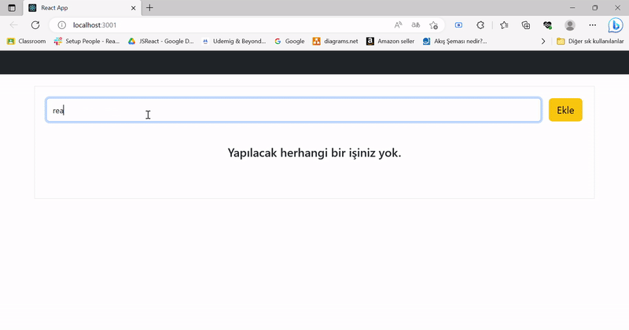

<h1>CRUD App</h1>

 Create Read Update Delete

Oluştur Oku Güncelle Sil

<ul>
<li>
    1- Create a form to get a new element to be added: take the data from the form and transfer the state, then create a new object with the information entered in the form when the add button is clicked, create a new object with the information entered in the form, the information that should be in the item: date, todoText, id, was it done? and transfer it to a state, reset the form after receiving what is written in the form.
</li>

<li>
    2- Take the elements found in the state and list them with map (print on the screen) > if there are no elements in the satte, the screen says there is nothing to do.
</li>

<li>
    3- Todo deletion: filter the todos array according to the id of the todos clicked when clicking the delete button next to the button of each todos and show the deleted one
</li>

<li>
    4- Completing the todo: find which todo has been clicked on the done button and reverse the isDone value, make the done button change to active and cross out the done todo
</li>
<li> 
    5- Edit: When the edit button is pressed, a modal will appear on the screen, there will be an input for the user to change the todo title through this modal, the title of the selected todo will be written in the input, there will be cancel and save buttons on the modal.
</li>

<li>
    6- Componentization: Separate reusable structures into compoenent
</li>
</ul>

